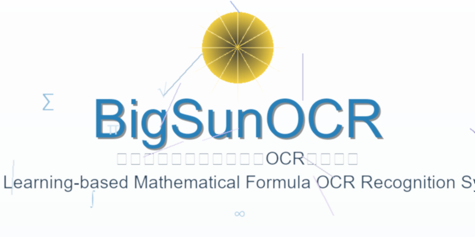

# BigSunOCR

<div align="center">
    
    <p>基于深度学习的数学公式OCR识别系统</p>
    <p>Deep Learning-based Mathematical Formula OCR Recognition System</p>
</div>

## 项目简介 | Project Introduction

这个项目由成都微珑汇科技有限公司（WIHEX.INC）的高级人工智能算法工程师开发。项目的主要目标是满足公司对于低成本训练和推理的相关OCR任务需要，特别是在教育和研究场景中，高效地识别手写数学公式和复杂的印刷公式。

该项目旨在对手写数学公式、印刷体公式以及复杂公式样本或综合性光学字符识别任务上达到良好的效果。

This project is developed by a senior artificial intelligence algorithm engineer from Chengdu Weilonghui Technology Co., Ltd. (WIHEX. INC). The main goal of the project is to meet the company's requirements for low-cost training and inference related OCR tasks, particularly in educational and research scenarios where handwritten mathematical formulas and complex printed formulas need to be recognized efficiently.

This project aims to achieve good results in handwritten mathematical formulas, printed formulas, complex formula samples, or comprehensive optical character recognition tasks.

## 技术特点 | Technical Features

该项目主要参考了CRNN的相关技术特点，并改进了CRNN对长序列的LaTeX公式不支持的问题。通过改变CNN层输出的数据张量形状，并重新排列张量的维度顺序，实现了对图片LaTeX公式的长序列支持。项目没有采用注意力机制，而是通过将图片进行特征融合送入一个ResNet18网络，再经过两个双向LSTM和log_softmax激活函数后，使用CTC损失函数计算损失并更新网络梯度。

项目还采用了一些优化方法，例如：
- 图片位置编码
- SEBlock（Squeeze-and-Excitation Block）
- 残差连接

This project mainly refers to the relevant technical characteristics of CRNN and improves the problem that CRNN does not support LaTeX formulas for long sequences. Specifically, the CNN layer's output tensor shape is modified to better handle long sequences, and the dimension order of the tensor is rearranged to ensure compatibility with image-based LaTeX formula recognition. 

The project does not use an attention mechanism but instead fuses image features into a ResNet18 network. After passing through two bidirectional LSTMs and the log_softmax activation function, the CTC loss function is used to calculate the loss and update the network gradient. Additional optimizations include:
- Image position encoding
- SEBlock (Squeeze-and-Excitation Block)
- Residual connections

## 环境要求 | Environment Requirements

```
python >= 3.8
pytorch == 2.4.0
opencv-python == 4.5.5
numpy
matplotlib
tqdm
```

## 安装指南 | Installation Guide

1. 克隆仓库 | Clone the repository
```bash
git clone https://github.com/yourusername/bigSunOCR.git
cd bigSunOCR
```

2. 安装依赖 | Install dependencies
```bash
pip install -r requirements.txt
```

3. 下载预训练模型 | Download pre-trained model
```bash
# 下载模型并放入model_data文件夹
# Download the model and put it in the model_data folder
# 模型下载链接 | Model download link: https://jidugs.wlhex.com/latex_OCR_model.pth
```

## 使用方法 | Usage

### 训练模型 | Training the Model

```bash
python trainModel.py
```

### 测试模型 | Testing the Model

```bash
python testModel.py
```

### 使用模型进行预测 | Using the Model for Prediction

```bash
python predict.py --image_path path/to/your/image.jpg
```

## 项目结构 | Project Structure

```
bigSunOCR/
├── Data-for-LaTeX_OCR/       # 数据集 | Dataset
│   ├── hand/                 # 手写公式数据 | Handwritten formula data
│   └── vocabDict/            # 词汇表 | Vocabulary dictionary
├── model/                    # 模型定义 | Model definition
│   └── model.py              # 模型架构 | Model architecture
├── model_data/               # 预训练模型 | Pre-trained models
│   └── latex_OCR_model.pth   # 预训练权重 | Pre-trained weights
├── assets/                   # 项目资源 | Project assets
│   └── logo.png              # 项目logo | Project logo
├── examples/                 # 示例代码 | Example code
│   └── example.py            # 使用示例 | Usage example
├── trainModel.py             # 训练脚本 | Training script
├── testModel.py              # 测试脚本 | Testing script
├── predict.py                # 预测脚本 | Prediction script
├── utils.py                  # 工具函数 | Utility functions
├── requirements.txt          # 依赖列表 | Dependency list
├── LICENSE                   # 许可证 | License
└── README.md                 # 项目说明 | Project description
```

## 性能指标 | Performance Metrics

### 训练效果 | Training Results
- 总损失 | Total Loss: 1.1550
- 平均损失 | Average Loss: 0.004812415804311362
- 平均准确度 | Average Accuracy: 0.98

### 测试效果 | Testing Results (CPU)
- 平均准确度 | Average Accuracy: 0.7133518634119548
- 平均推理时间 | Average Inference Time: 0.0876441 秒 | seconds

### 验证效果 | Validation Results (CPU)
- 平均准确度 | Average Accuracy: 0.778784725587209
- 平均推理时间 | Average Inference Time: 0.0857531323529412 秒 | seconds


## 联系方式 | Contact Information

**项目负责人 | Project Leader:**
- 昵称 | Nickname: 太阳大 (Big Sun)
- 邮箱 | Email: 775106129@qq.com
- 公司邮箱 | Company Email: fxc@wlhex.com

如需进行学术研究或有任何问题，欢迎发送邮件获取技术细节或讨论潜在合作。

If you need to conduct academic research or have any questions about this project, feel free to send an email to obtain technical details or discuss potential collaborations.

## 许可证 | License

Apache License Version 2.0, January 2004
http://www.apache.org/licenses/

Copyright (c) 2024 XingChengFu (bigSun), WLHEX INC.

Licensed under the Apache License, Version 2.0 (the "License"); you may not use this file except in compliance with the License. You may obtain a copy of the License at http://www.apache.org/licenses/LICENSE-2.0 Unless required by applicable law or agreed to in writing, software distributed under the License is distributed on an "AS IS" BASIS, WITHOUT WARRANTIES OR CONDITIONS OF ANY KIND, either express or implied. See the License for the specific language governing permissions and limitations under the License.